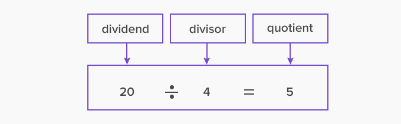

## How the code works
___
line 1-4
```
from machine import Pin, I2C
import ds1307
from time import localtime, mktime, sleep
```


We first import all the necessary libraries. Here is an explanation of the `time.mktime()` function from the [Micropython docs](https://docs.micropython.org/en/latest/library/time.html).
from Micropython docs:
>time.mktime()
>
>This is inverse function of localtime. It’s argument is a full 8-tuple which expresses a time as per localtime. It returns an integer which is the number of seconds since Jan 1, 2000.


The `ds1307` is a library used to interface with RTC module. Find it [here.](https://github.com/mcauser/micropython-tinyrtc-i2c).
___
line 6-20
```
#rtc i2c pins
sda_pin = 26
scl_pin = 27

#pins for 7seg display
digits = (9, 8, 7, 6) #dig 1 2 3 4
segments = (11, 12, 16, 14, 17, 10, 13) # A B C D E F G, dp at Pin 15

#pins to activate relays
rel1 = 18
rel2 = 19

#rtc i2c setup
i2c = I2C(1, sda=Pin(sda_pin), scl=Pin(scl_pin))
ds = ds1307.DS1307(i2c)
```
<p>
We create variables for our circuit configuration. And then initiate the I2C and create a ds1307 class.
</p>
___
line 22-33
```
#segments values for displaying numbers  
num = {"-": (0,0,0,0,0,0,0),
       "0": (1,1,1,1,1,1,0),
       "1": (0,1,1,0,0,0,0),
       "2": (1,1,0,1,1,0,1),
       "3": (1,1,1,1,0,0,1),
       "4": (0,1,1,0,0,1,1),
       "5": (1,0,1,1,0,1,1),
       "6": (1,0,1,1,1,1,1),
       "7": (1,1,1,0,0,0,0),
       "8": (1,1,1,1,1,1,1),
       "9": (1,1,1,1,0,1,1)}
```
The tuples store the states (0=OFF, 1=ON) of the LED segments in order order to display each digit. *NB:* "-" is a blank character which keeps all segments off.
___
line 35-48
```
Pin(rel1, mode=Pin.OUT, value=0)
Pin(rel2, mode=Pin.OUT, value=0)

def init():
    #initiate digit pins at HIGH
    for digit in digits:
        Pin(digit, Pin.OUT)
        Pin(digit).on()
    
    #initiate segment pins at LOW
    for seg in segments:
        Pin(digit, Pin.OUT)
        Pin(digit).off()
init()
```
Relay pins begin as OFF. The `init()` function takes the display off. For the display to be off, the digit pins should be ON while the segments should be GND.
___
line 50
```
deadline = (2022, 1, 2, 17, 41, 0, 0, 0)  #time to countdown to
```
This value can be changed to a desired date and/or time. It is the target time for the countdown, and it is the 8-tuple time format used in micropython:

>`(year, month, mday, hour, minute, second, weekday, yearday)`
...
>The format of the entries in the 8-tuple are:
>
year includes the century (for example 2014).
>
month is 1-12
>
mday is 1-31
>
hour is 0-23
>
minute is 0-59
>
second is 0-59
>
weekday is 0-6 for Mon-Sun
>
yearday is 1-366

___
**The subsequent code runs inside of a `while True` loop **
___
line 54
```
current = localtime() #current = ds.datetime() for RTC

#time difference between the two events/moments in seconds
diff = mktime(deadline) - mktime(current)
```
First of all, we get the current time either from port when the board is connected, `time.localtime()`, or from the RTC, `ds.datetime()`.

When we pass the `deadline` or the `current` variables into `local.mktime()`, we get the time, in seconds since the epoch (info about local.mktime() [at the top]())
Mathemetically, by subtracting time-since-epoch of both `deadline` and `current`, we get the time difference between `deadline` and `current`, hence time to go until its the `deadline`.
___
line 59-62
```
#convert seconds to hours, minutes, seconds
hours, minutes = divmod(diff,3600)
minutes, seconds = divmod(minutes,60)
seconds = int(seconds)
```


Since the time is in seconds, we have to convert it to total **Hours, Minutes, and Seconds**. To that, we have to
<ol>
<li>find the total hours in `diff` by dividing the value by the number seconds in an hour, 3600 seconds. The remainder from this division will give total minutes then seconds</li>
<li>dividing on the remainder with 60 (number of seconds in a minute) gives total minutes. The remainder from this division is the seconds</li>
</ol>

So how `divmod` works is that you pass two parameters, the dividend followed by the divisor and the functions returns a tuple: first item is the quotient then the second item is the remainder.


In this line `seconds = int(seconds)`, we take only the integer of the previous `seconds` variable, discarding everything behind the decimal point.
___
line 63-67
```
#choosing between seconds countdown and HH:MM countdown
if (hours == 0) and (minutes <=1):
    s = f"--{seconds:02d}" 
else:
    s = f"{hours:02d}{minutes:02d}" 
```
Before the countdown time goes below a minute, the time is displayed as hours and minutes (HHMM), and when it is under a minute, we display seconds (--SS).
___
line 69-74
```
for digit in range(4):
    for seg in range(7):
        Pin(segments[seg], mode=Pin.OUT, value=num[str(s[digit])][seg])
    Pin(digits[digit], mode=Pin.OUT, value=0)
    sleep(0.001)
    Pin(digits[digit], mode=Pin.OUT, value=1)
```
`for digit in range(4):`
'`for seg in range(7):` 
These loop through every segment of every digit.

Let us break this `Pin(segments[seg], mode=Pin.OUT, value=num[str(s[digit])][seg])` down:
<ol>
<li>`segments[seg]`- The pin number of the segment to be addressed is selected from the `segments` array by using the current counter value as the index.</li>
<li>`mode=Pin.OUT`- The pin is to be an output</li>
<li>`value=num[str(s[digit])][seg]` <ul>
Example, let me explain it with our value of `s` representing 2 hours 30 min:
`s = "0230"`

<li>`str(s[digit])`-from `s`, we set the position of the digit to handle, indexed by `digit` counter from outer loop. We convert this value to string.</li>
`>>> On first run of the loop we will have "0"`
<li>`num[str(s[digit])]`-the string we found, we use it as a key to look up the `num` dictionary in order to get the tuple with LED state valus that represent different digits.</li>
`>>> For a key of "0", we have the value (1,1,1,1,1,1,0)`
<li>`num[str(s[digit])][seg]`-we index the tuple with the current value of seg counter. And the tuple item we get at whatever index will be either 1(ON) or 0(OFF) to define the state of the respective segment.</li>
`>>>If seg is equal to 3, then we get a 1 which we assign to the value parameter to turn the segment ON.`
</ul>
the loop runs 7 times to appropriately, turn on the 7 segments that make up a digit.
</ol>


In this line `Pin(digits[digit], mode=Pin.OUT, value=0)`, `digits[digit]` indexes `digits` tuple to get the pin number of the digit to control. We set the  pin to OFF (or GND) in order to bring the digit on.
So these 3 lines `Pin(digits[digit], mode=Pin.OUT, value=0)`, ``sleep(0.001)`, and `Pin(digits[digit], mode=Pin.OUT, value=1)` control the display to show a single digit at a time, and then bring it off before showing another digit individually. The digits on the display appear as if they are all displayed simaltenously instead of individually. This is because thecycle of displaying the digits individually occurs very fast, it runs over each digit in 1 millisecond or 0.001 seconds.
___
line 76-80
```
if s == "--00":
    Pin(rel1, mode=Pin.OUT, value=1)
    sleep(2)
    Pin(rel2, mode=Pin.OUT, value=1)
    quit
```
if we have reached the end of our countdown, i.e time left to `deadline` is 0, or `s` is "--00", we turn ON the pins where relays are connected. This sets alight the fireworks.
We then quit the `while`loop.
___
line 81
We run the `init()` function to turn the display off.
***
## To do
- [x] Documet code
- [ ] Document circuit
- [ ] Explain how the display works
- [ ] Explain the maling of electronic igniters
